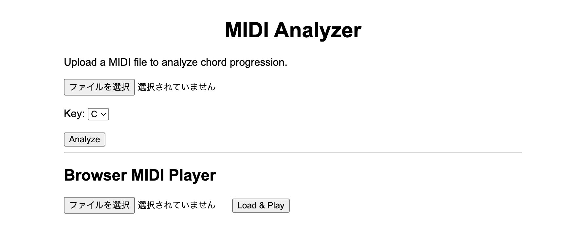

# 🎵 MIDIコード解析Webアプリ

MIDIファイルをアップロードすると、コード進行およびスケール外音を解析・表示するWebアプリです。

---

## 📌 概要

MIDIデータからノートとベース音を抽出し、音楽理論に基づいてコード（転回形含む）を判定します。  
また、スケール外の音も検出します。

---

## 🛠 使用技術

- Python（Flask）
- HTML / CSS（Jinja2）


---

## 🎯 主な機能

- MIDIファイルアップロード


---

## 💡 工夫した点

- 音楽理論（コード・スケール）をアルゴリズムとして実装
  

## 🚀 セットアップ方法

```bash
git clone https://github.com/mike0209-create/midi-analyzer.git
cd midi-analyzer
pip install -r requirements.txt
python app.py

ディレクトリ構成
Project/
├ app.py
├ analyzer/
├ templates/
├ images/


作者　GitHub：https://github.com/mike0209-create
---

#完成品スクリーンショット


## フォルダ作成

```bash
mkdir images


## 🖥 初期画面


## 📊 解析結果

